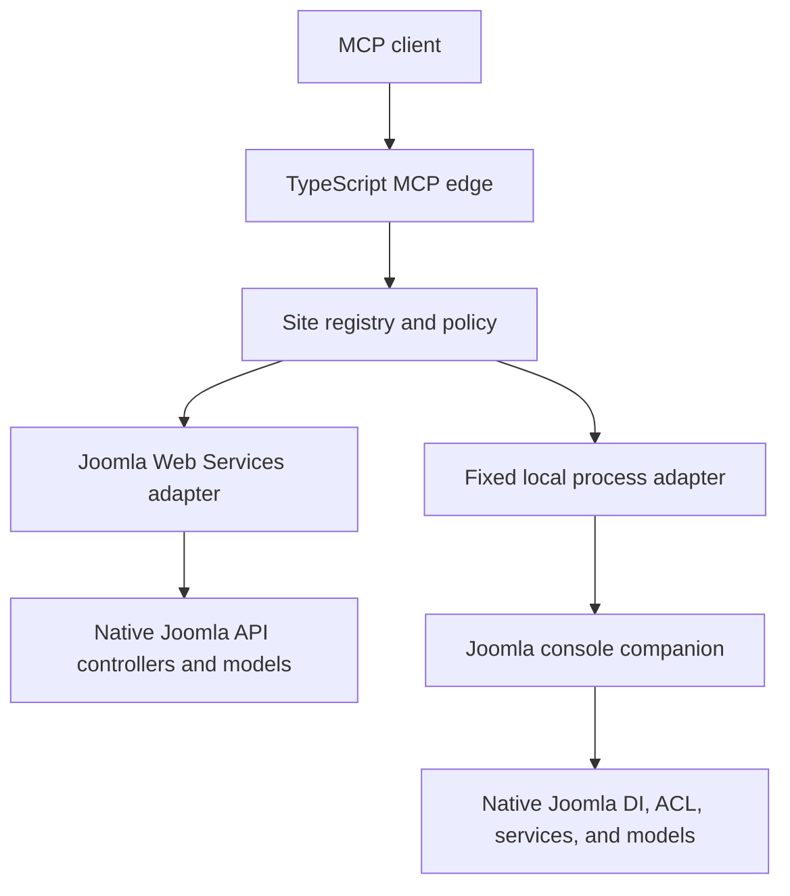

# Architecture and native-first rules

## System boundary

JoomEngine MCP for Joomla translates bounded semantic MCP actions into native Joomla operations. The TypeScript edge owns MCP protocol concerns; Joomla remains responsible for domain behavior, validation, persistence, events, permissions, and extension integration.



## Why this stack

TypeScript is a Tier 1 MCP SDK while PHP is Tier 3. For convenience, TypeScript is used and PHP where possible.

## Native-first decision rules

Every action follows these rules:

1. Joomla CMS source for the supported branch is the authority for routes, commands, models, ACL, state transitions, and lifecycle behavior.
2. Use an existing Joomla Web Services route when it exposes the required behavior with an adequate permission boundary.
3. For on-server use, call Joomla through its console application, dependency-injection container, services, and administrator models.
4. Add a companion action only when a typed JSON contract, effective actor ACL, safe secret transport, or structured output is needed around native behavior.
5. Do not copy Joomla domain logic into the edge or companion. The adapter selects and validates a fixed native operation; Joomla performs it.
6. Do not parse localized stock CLI output into authoritative records. Use a native structured companion action instead.
7. Do not fill a gap with arbitrary HTTP, command, shell, PHP, SQL, filesystem, URL, component, model, or method execution.
8. A capability is not production-approved until its exact native path, permission denial, success postcondition, failure behavior, and recovery path pass the supported live matrix.

These rules avoid parallel implementations that could bypass Joomla plugin events, validation, table behavior, or extension overrides.

## TypeScript MCP edge

The edge owns:

- stdio and Streamable HTTP MCP transports;
- immutable multi-site aliases;
- inbound identity, site, and toolset authorization;
- the source-backed semantic action catalogue;
- route and input bounds;
- downstream API and local companion selection;
- write preview, plan, confirmation, idempotency, coordination, audit, and verification;
- response, pagination, process, request, session, and rate limits.

The edge does not accept a Joomla origin, Joomla root, PHP executable, environment, downstream credential, or transport target from a tool call.

## Remote Joomla API path

The API adapter calls one configured HTTPS origin with a dedicated downstream Joomla token. MCP access tokens and Joomla API tokens are distinct and are never passed through.

Semantic action descriptors map to fixed Joomla routes and methods. The adapter:

- sends Joomla's expected flat form JSON for mutations;
- normalizes JSON:API responses and errors;
- caps pagination, time, and response bytes;
- rejects redirects;
- uses only the server-configured origin and credential;
- treats returned Joomla content as untrusted data.

The API path is preferred for remote administration and for capabilities already exposed by core Web Services plugins.

## Local Joomla companion path

The local adapter starts only the configured PHP executable and `<joomla-root>/cli/joomla.php` with an argument array and no shell. JSON requests travel over stdin. Time, output, environment, executable, and working directory are bounded by server configuration.

The installed companion registers:

```text
joomla:mcp:describe --format=json --no-interaction --no-ansi
joomla:mcp:dispatch --input=- --format=json --no-interaction --no-ansi
joomla:mcp:self-test --format=json --no-interaction --no-ansi
joomla:mcp:cli-inventory --format=json --no-interaction --no-ansi
```

The companion boots through Joomla's console application and uses Joomla's container, identity, ACL, services, and fixed administrator models. It is an adapter around native Joomla behavior, not an alternate administration framework. Each action has a stable identifier, schema, risk, permission declaration, and fixed native target.

Stock Joomla CLI commands remain useful as the source of native maintenance capability. Generic execution is intentionally unavailable because their output is human-oriented and the CLI has no API-token ACL boundary. Safe use requires a reviewed semantic wrapper, structured result, explicit scope, and recovery contract.

## Catalogue and capability negotiation

The edge catalogue records each action's semantic ID, Joomla version range, domain, route or local driver, schema, toolset, ACL, risk, pagination, and verification behavior. The companion describes its effective action set and configured actor permissions at runtime.

Execution is the intersection of:

- an edge catalogue action;
- a configured adapter for the site;
- the site's enabled toolset;
- the authenticated remote principal's site and toolset scopes;
- the companion's advertised action and effective actor permission, when local;
- the write confirmation policy, when mutating.

An action being present in source, the edge catalogue, or companion description alone does not make it executable.

The TypeScript edge can consume the language-neutral [joomla-mcp-spec](https://github.com/joomengine/joomla-mcp-spec) tree as the preferred catalogue source. `JOOMLA_MCP_SPEC` or `createRuntime({ specRoot })` points at a spec checkout. The spec layer loads meta, toolsets, write-field allowlists, family documents, and the public MCP tool contract fail-closed, then maps those artefacts onto the existing `ReadActionDescriptor` / `WriteActionDescriptor` / `CrudBaseDescriptor` types. Spec `{id}` route placeholders become runtime `:id` templates; spec write fields are nested under `data` so plan/apply stays unchanged. When the spec root is unset, the in-repo catalogue remains the authority. A configured but missing or invalid spec is a hard error.

## Multi-site and identity model

- Site aliases are immutable server-side configuration.
- Each Joomla site uses a dedicated downstream API user and/or dedicated companion actor.
- Remote MCP principals receive explicit site and toolset scopes.
- The companion operating-system process runs as a dedicated deployment account, never root.
- Audit, rate, confirmation, idempotency, and lock identities include the relevant principal, site, and action.
- Strict tenants can use separate processes or deployments.

## Write protocol

A write is selected by semantic ID and validated against a fixed route or native action. A dry run produces a preview without a token. A non-dry plan stores the exact validated operation and returns a short-lived, signed, one-time token bound to the authenticated issuer, subject, and client. Apply rechecks the planned site/toolset authorization before consuming that token and cannot replace the planned input.

Joomla remains the final validator and mutation authority. API writes use verification reads where implemented; companion writes must return proof that the native model applied the operation. Privileged operations additionally require action-specific preconditions, rollback instructions, and recovery tests.

Current in-process confirmation, lock, idempotency, session, and rate state is suitable for a single replica. Write-enabled multi-replica deployment is gated until shared coordination is configured and tested.
